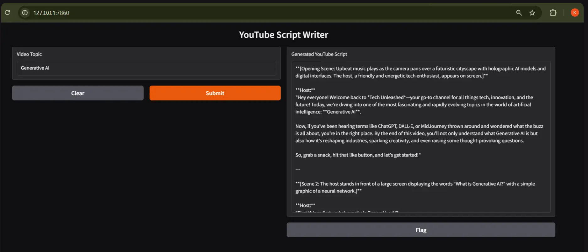

# Deepseek Gen AI Apps - Prompting

A collection of lightweight Gradio applications demonstrating how to build AI-powered tools using the DeepSeek (OpenAI-compatible) API via DeepInfra. Each app showcases a different real-world use case, from sentiment analysis to itinerary planning.
 
## Apps Overview

1. **Sentiment Analysis App** (`customer_sentiment_analysis.py`)
   - Analyze the sentiment of any input text.
    

2. **Legal Document Summarizer** (`legal_document_summariser.py`)
   - Upload a PDF legal document and receive a concise 5-point summary highlighting key clauses.
    

3. **Marketing Campaign Assistant** (`marketing_campaign_assistant.py`)
   - Generate marketing copy for a product, including target audience, features, and call-to-action.
    

4. **Travel Itinerary Planner** (`travel_itinerary_planner.py`)
   - Create a multi-day travel itinerary by specifying destination, duration, and interests.
    

5. **YouTube Script Writer** (`youtube_scriptwriter.py`)
   - Produce a detailed YouTube video script based on the provided topic.
    
   
## Features

- **Easy Prompting**: Each app demonstrates structured prompting for effective AI responses.
- **Gradio Interfaces**: Quick web-based UIs for rapid testing and deployment.
- **Modular Code**: Reusable patterns for initializing the OpenAI client and handling responses.
- **Environment Configuration**: Uses `python-dotenv` for secure API key management.

## Prerequisites

- Python 3.7 or higher 
- A valid DeepInfra (DeepSeek-V3) API key

## Installation

1. Clone this repository:
   ```bash
   git clone https://github.com/kponna/Deepseek_Gen_AI_apps-prompting.git
   cd Deepseek_Gen_AI_apps-prompting
   ```
2. Install the dependencies:
   ```bash
   pip install -r requirements.txt
   ```

## Configuration

1. Create a `.env` file in the project root:
   ```ini
   API_KEY=your_deepinfra_api_key_here
   ```
2. Make sure the `.env` file is in the same directory as the scripts.

## Running the Apps

Each script can be run individually. For example:

```bash
python customer_sentiment_analysis.py
```

This will launch a local Gradio interface (usually at `http://localhost:7860`).

Repeat for other scripts:

```bash
python legal_document_summariser.py
python marketing_campaign_assistant.py
python travel_itinerary_planner.py
python youtube_scriptwriter.py
```  
 
